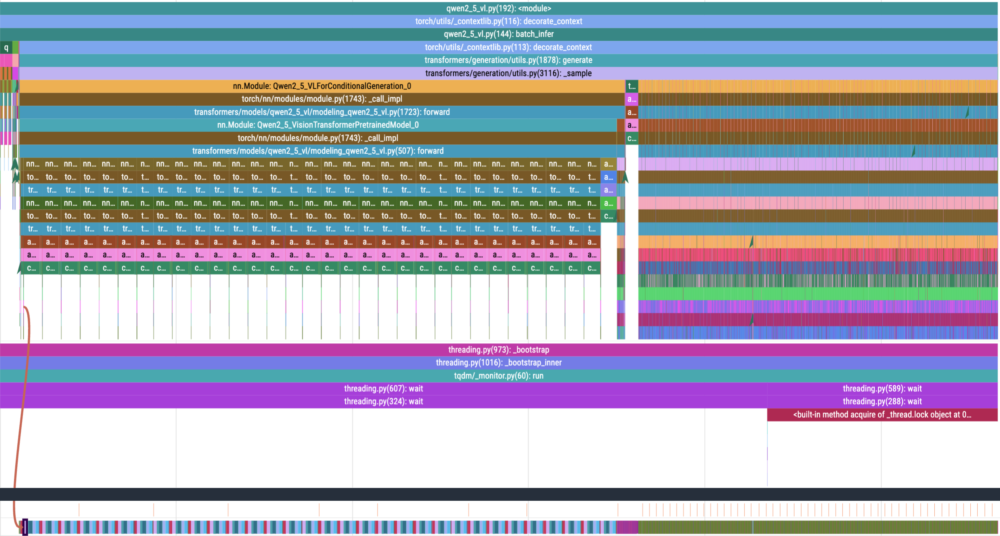
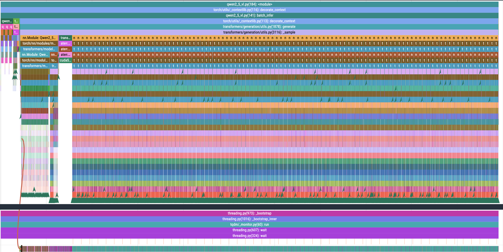
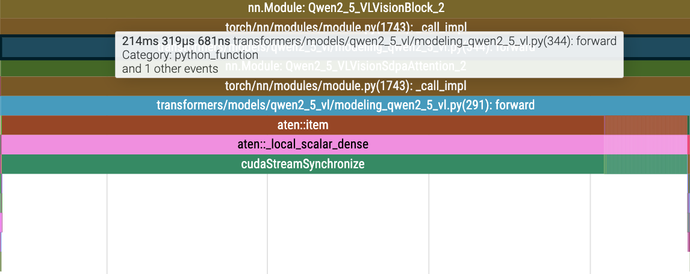
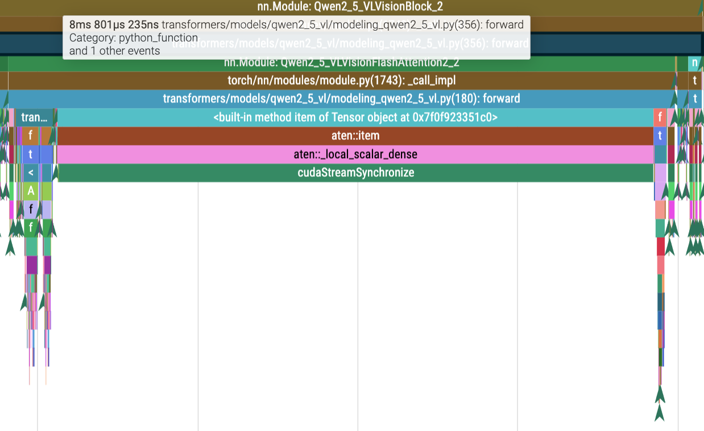
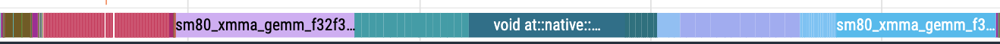
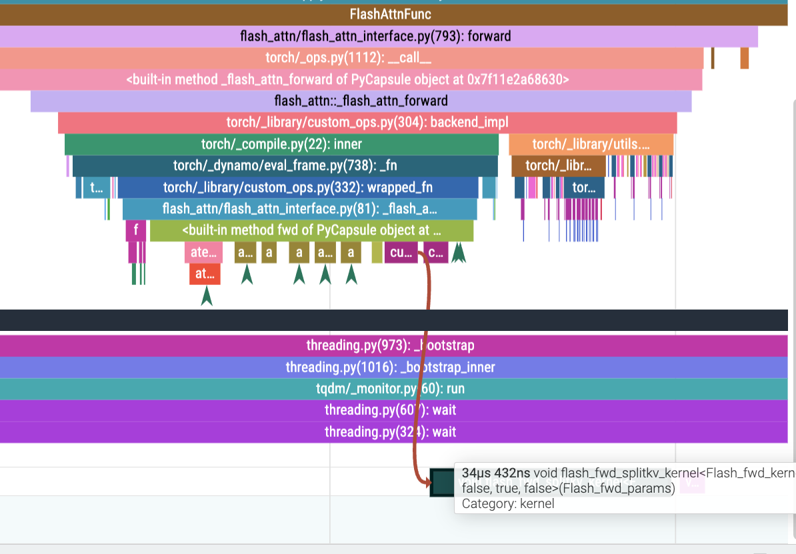

# FlashAttention 优化

因为 transformers 里内置兼容了 `flash-attn`，我们仅需在加载模型时加入一个参数即可！

```Python
self.model = Qwen2_5_VLForConditionalGeneration.from_pretrained(
    model_name,
    torch_dtype=torch.float16,
    device_map="auto",
    attn_implementation="flash_attention_2", # <- 就这个参数
)
```

而使用 flash attention 的效果非常拔群，效率提升接近 **66.7%**

```bash
# No torch compile
batch_infer time: 9.930200099945068

# torch compiled
batch_infer time: 8.901242733001709

# enable flash attention
batch_infer time: 3.28806471824646
```

其实 Flash Attention 的优化到这里就结束了。但是我更好奇 flash-attn 后的 profile 会是怎样的，于是把它的 profile 跑出来了：

**No Flash Attention(Duration: 11s 887s)**

- `Profill` duration: 7s 171ms

- `Decode` duration: 4s 368ms



**Flash Attention(Duration: 5s 450ms)**

- `Profill` duration: 568ms 340µs

- `Decode` duration: 4s 012ms



从两个图像都可以看出，Qwen2.5-VL 模型推理包含两个阶段，分别是 `Profill` 和 `Decode`。接下来我会分别从这两个阶段进行分析。

## Profill

从图像和数据可见，开启 `flash-attn` 后的 Profill 耗时直接从 **7s 171ms -> 568ms 340µs，提升接近 12.6x**，简直就是魔法！！具体看一下 `Profill` 中每次 `forward` 需要的时间开销

**No Flash Attention(Duration: 214ms 319µs)**



**Flash Attention(Duration: 8ms 801µs)**



可见在 `forward` 中就有 **20 多倍的提升**。这里我找到了 `flash-attn` 的主要优化部分：

**No Flash Attention**




**Flash Attention**


很明显可以发现，`flash-attn` 合并了多个小 Kernel，**把多个能合并的矩阵计算都放到一个 Kernel 中实现**，**减少了访存开销和 kernel launch overhead。** 这其实也是 `Flash Attention` 的**核心思想**。

## Decode

其实我仔细看了看，在 `Decode` 阶段，`flash-attn` 的优化就没有那么明显了。主要还是因为 `Decode` 也是全都是在做 Attention，还有其他的计算，`flash-attn` 能优化的部分其实并不多。

比较明显的可能就是在这里吧。更多的还是需要人为分析问题，做更细致的算子优化。


