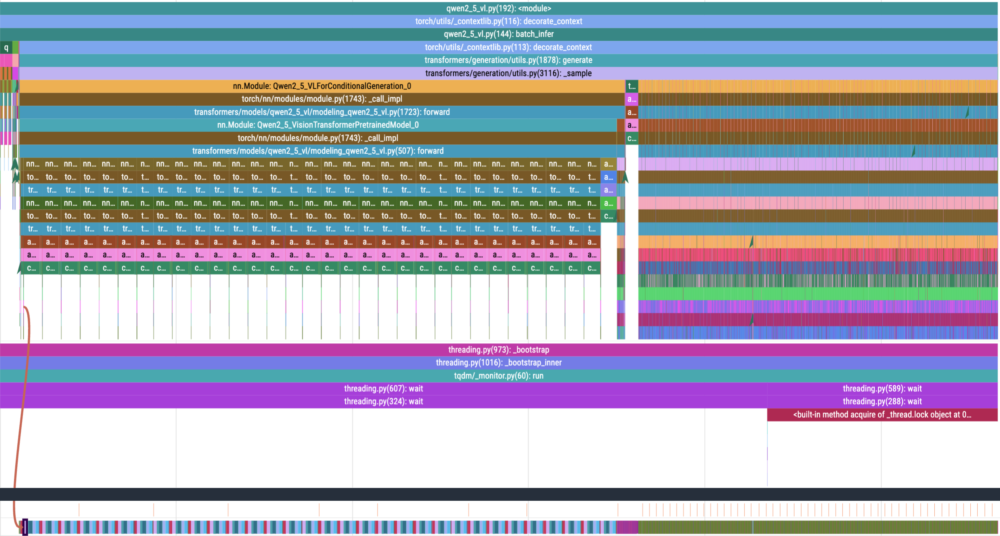
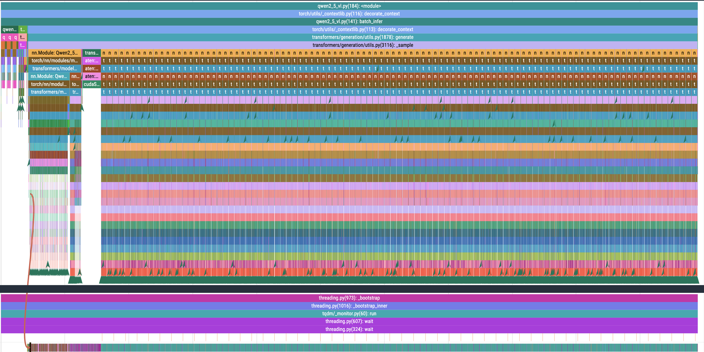

# FlashAttention 优化

因为 transformers 里内置兼容了 `flash-attn`，我们仅需在加载模型时加入一个参数即可！

```Python
self.model = Qwen2_5_VLForConditionalGeneration.from_pretrained(
    model_name,
    torch_dtype=torch.float16,
    device_map="auto",
    attn_implementation="flash_attention_2", # <- 就这个参数
)
```

而使用 flash attention 的效果非常拔群，效率提升接近 **66.7%**

```bash
# No torch compile
batch_infer time: 9.930200099945068

# torch compiled
batch_infer time: 8.901242733001709

# enable flash attention
batch_infer time: 3.28806471824646
```

其实 Flash Attention 的优化到这里就结束了。但是我更好奇 flash-attn 后的 profile 会是怎样的，于是把它的 profile 跑出来了：

No Flash Attention



Flash Attention


